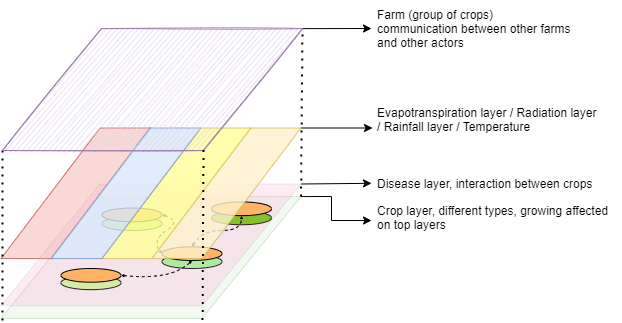
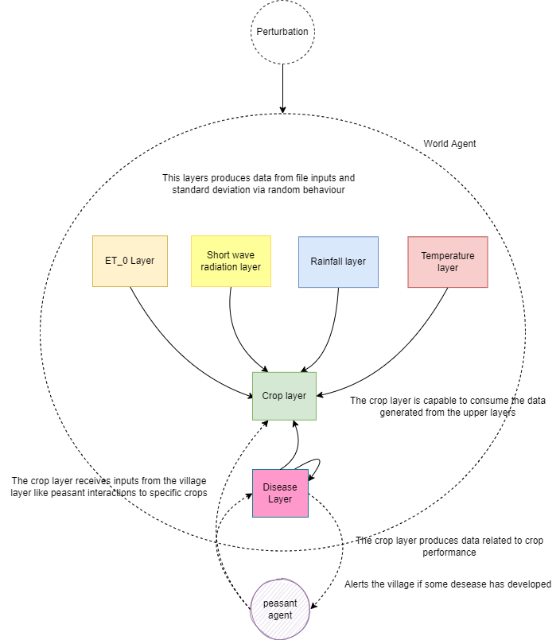

# Space and world modelling
The present repository holds the novel cellular automaton multi layer framework that allows the modeling of the space.
The repository also holds an implementation of this framework using a fresh new growth vegetal modeling that uses the FAO Penman-Monteith equation.
This equation considers principally the climatic variables to estimate the crop growth.

This modeling contains a prototype of the world modelled. It is separated into 3 packages, the first one (automata.core) contains the framework that is a collection
of interfaces and abstract classes that provides a reference to build layers and cells. The second (world), holds the implementation for a wide variety of environmental layers, with
its respective transition functions to generate the new cell states. Finally, the third package (agents) holds the construction of the BESA agents, in this case
a world agent was implemented and a peasant agent was implemented as well (image below). The main entry point is the App.java

This simulator contains various configuration keys that modifies the behavior during the simulation, the configuration keys are in the
resources/app.properties file. Then, the configuration keys are listed with the functionality

- data.radiation= file location for the radiation data
- data.rainfall= file location for the radiation data
- data.rainfall.wet= file location for the radiation data
- data.rainfall.dry= file location for the radiation data
- data.temperature= file location for the radiation data
- data.evapotranspiration= file location for the radiation data
- date.format= date format to parse ej: "dd/MM/yyyy"
- waterStress.enabled = enable or disable water stress behavior
- rainfall.thresholdPercentage = threshold where the rainfall from the average is taken into account 
- disease.incrementProbabilityPerDay = probability of a new disease increment per day
- disease.incrementNeighborInfected = probability increment if a crop neighbor is infected
- disease.insecticideEfficacyDays = days that insecticide application prevents from infections
- disease.insecticideDefaultCoverage = default Coverage of the crop that the insecticide covers
- disease.damagesCrop= Factor that affects the crop evapotranspiration
- crop.dataFiles= Data result file location (.csv extension file)
- crop.defaultValuePerIrrigation= Default value when a irrigation action takes place
- agb.maximumRadiationEfficiency = Crop radiation efficiency
- agb.conversionFactor = Crop conversion factor to AGB
- course.waterCropIfStressImprovement = Course perturbation, increment of care from the peasants when water stress occur
- course.insecticideIfDiseaseImprovement = Course perturbation, increment of care from the peasants when crop infection occur

Happy space coding!